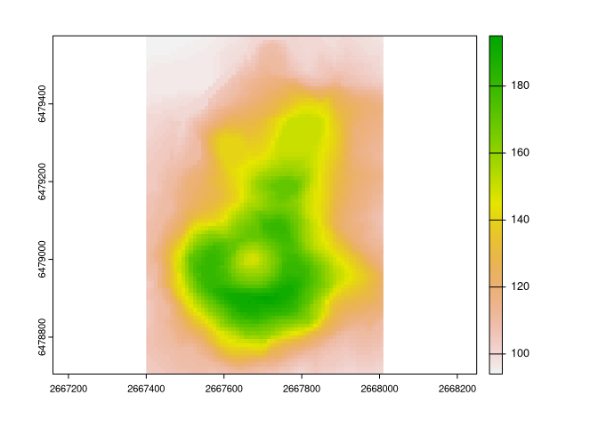
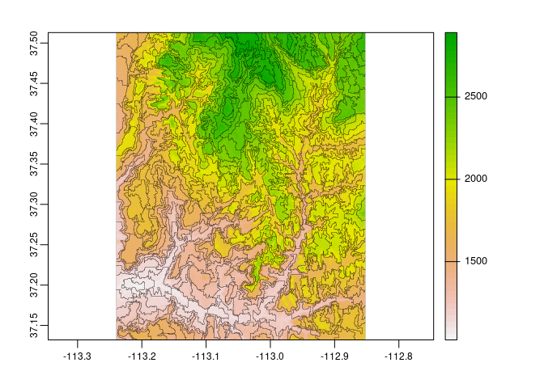

<!-- README.md is generated from README.Rmd. Please edit that file -->

# supercells 

<!-- badges: start -->

[](https://CRAN.R-project.org/package=supercells)
[](https://github.com/Nowosad/supercells/actions)
[](https://app.codecov.io/gh/Nowosad/supercells?branch=master)
[](https://cran.r-project.org/package=supercells)
<!-- badges: end -->

The goal of **supercells** is to utilize the concept of superpixels to a
variety of spatial data. This package works on spatial data with one
variable (e.g., continuous raster), many variables (e.g., RGB rasters),
and spatial patterns (e.g., areas in categorical rasters). It is based
on the SLIC algorithm (Achanta et al. (2012)), and readapts it to work
with arbitrary dissimilarity measures.

## Installation

You can install the released version of supercells from
[CRAN](https://CRAN.R-project.org) with:

``` r
install.packages("supercells")
```

You can install the development version from
[GitHub](https://github.com/) with:

``` r
install.packages("supercells", repos = "https://nowosad.r-universe.dev")
```

<!-- ``` r -->
<!-- # install.packages("remotes") -->
<!-- remotes::install_github("Nowosad/supercells") -->
<!-- ``` -->

## Example

``` r
library(supercells)
library(terra)
#> terra 1.6.49
library(sf)
#> Linking to GEOS 3.11.0, GDAL 3.5.2, PROJ 9.0.1; sf_use_s2() is TRUE
vol = rast(system.file("raster/volcano.tif", package = "supercells"))
plot(vol)
```



``` r
vol_slic1 = supercells(vol, k = 50, compactness = 1)
plot(vol)
plot(st_geometry(vol_slic1), add = TRUE, lwd = 0.2)
```



## Documentation

See the package’s vignettes:

1.  [The `supercells()`
    function](https://jakubnowosad.com/supercells/articles/main-function.html)
2.  [Superpixels of a single raster
    layer](https://jakubnowosad.com/supercells/articles/articles/one_var.html)
3.  [Superpixels of an RGB
    raster](https://jakubnowosad.com/supercells/articles/articles/rgb_vars.html)
4.  [Superpixels of spatial categorical
    patterns](https://jakubnowosad.com/supercells/articles/articles/motifels.html)
5.  [Experimental features of the supercells
    package](https://jakubnowosad.com/supercells/articles/articles/experimental.html)

Watch the presentations about this package and some related ideas:

1.  *Spatial segmentation in R using the supercells package*,
    2021-09-02, OpenGeoHub Summer School -
    [slides](https://jakubnowosad.com/ogh2021/),
    [video](https://doi.org/10.5446/54880)
2.  *Generalizing the Simple Linear Iterative Clustering (SLIC)
    superpixels*, 2021-09-28, GIScience 2021 -
    [slides](https://jakubnowosad.com/giscience-2021/),
    [video](https://www.youtube.com/watch?v=AlyEFkyKLUw&t=2018s)

Read the related article:

1.  Nowosad, J., Stepinski, T. (2022). Extended SLIC superpixels
    algorithm for applications to non-imagery geospatial rasters.
    International Journal of Applied Earth Observation and
    Geoinformation, <https://doi.org/10.1016/j.jag.2022.102935>

## Contribution

Contributions to this package are welcome - let us know if you need
other distance measures or transformations, have any suggestions, or
spotted a bug. The preferred method of contribution is through a GitHub
pull request. Feel also free to contact us by creating [an
issue](https://github.com/nowosad/supercells/issues).
