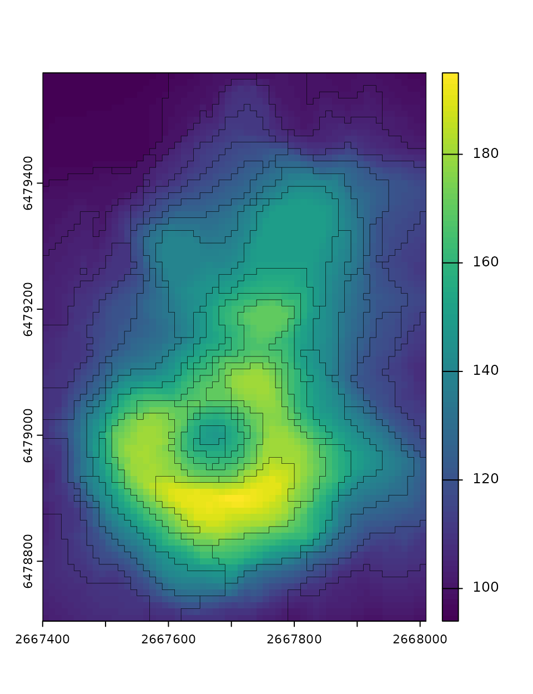

# Superpixels of a single raster layer

Superpixels is a collection of segmentation concepts of grouping pixels
with similar characteristics. It is often used in computer vision to
delineate parts of RGB images that are more meaningful and easier to
analyze. When applied to RGB images, each superpixel contains similar
colors that also could represent real-world objects. A large number of
methods for creating superpixels were developed in the last decades,
with the SLIC algorithm (Achanta et al. (2012),
<doi:10.1109/TPAMI.2012.120>) being the most prominent.

The **supercells** package aims to utilize the concept of superpixels to
a variety of spatial data. This package works on spatial data with one
variable (e.g., continuous raster), many variables (e.g., RGB rasters),
and spatial patterns (e.g., areas in categorical rasters). Therefore, it
enables not only to find areas that look similar on an RGB (satellite)
image, but also to regionalize areas with comparable values of one or
more variables.

This vignette shows how to use the **supercells** package on a single
raster layer. To reproduce the following results on your own computer,
install and attach the packages:

``` r
library(supercells)    # superpixels for spatial data
library(terra)         # spatial raster data reading and handling
library(sf)            # spatial vector data reading and handling
```

## Default arguments

The first step is to read the input data. Here, we are going to use
`volcano.tif` example data that is already included in the
**supercells** package.

``` r
vol = rast(system.file("raster/volcano.tif", package = "supercells"))
plot(vol)
```


It contains a digital elevation model for the Maunga Whau volcano, where
each value represents an elevation above sea level.

The **supercells** package can be used here to delineate areas with
similar elevations. It has one main function,
[`supercells()`](https://jakubnowosad.com/supercells/reference/supercells.md),
which expects at least three arguments:

- `x` - an input raster (an object of class SpatRaster from the
  **terra** package)
- `k` - an expected number of superpixels
- `compactness` - a compactness value. Larger values create more
  compact/even (square) superpixels

``` r
vol_slic1 = supercells(vol, k = 50, compactness = 1)
vol_slic1
```

The
[`supercells()`](https://jakubnowosad.com/supercells/reference/supercells.md)
output is an `sf` object, where each row represents a single superpixel.
It stores superpixels ids (`supercells`), coordinates of the
superpixels’ centroids (`x` and `y`), and an average of all of the input
variables (`elevation` in this case).

It allows us to plot the superpixels’ borders on top of the input raster
data:

``` r
plot(vol)
plot(st_geometry(vol_slic1), add = TRUE, lwd = 0.2)
```


The `vol_slic1` object can be a final result of the analysis or used for
further grouping or clustering.

## Customized arguments

The
[`supercells()`](https://jakubnowosad.com/supercells/reference/supercells.md)
function also has a set of optional arguments, including:

- `step` - a distance (in the number of cells) between initial
  superpixel’ centers. It can be used instead of `k`
- `dist_fun` - a distance function used to calculate similarities
  between raster values
- `clean` - should connectivity of the superpixel be enforced? If
  `FALSE`, then some superpixels could consist of several nonadjacent
  regions. It is `TRUE` by default.
- `iter` - a number of iterations performed to create the output. It is
  `10` by default.

Let’s try to change the values of some of them:

``` r
vol_slic2 = supercells(vol, step = 11, compactness = 1, dist_fun = "euclidean", 
                       clean = FALSE, iter = 10)
```

The output still has the same structure (is an `sf` object with
superpixels ids, coordinates of their centroids, and an average of all
of the input variables), but has a slightly different number of
superpixels, and their borders are a bit different.

``` r
plot(vol)
plot(st_geometry(vol_slic2), add = TRUE, lwd = 0.2)
```



## References

Achanta, Radhakrishna, Appu Shaji, Kevin Smith, Aurelien Lucchi, Pascal
Fua, and Sabine Süsstrunk. 2012. “SLIC Superpixels Compared to
State-of-the-Art Superpixel Methods.” *IEEE Transactions on Pattern
Analysis and Machine Intelligence* 34 (11): 2274–82.
