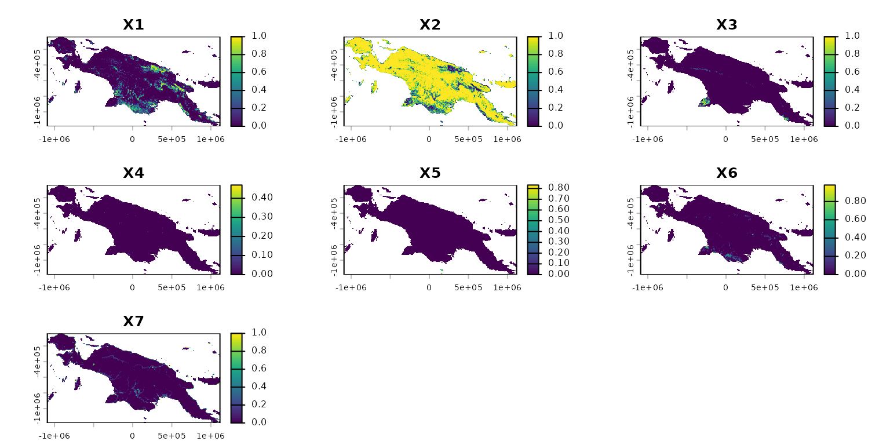
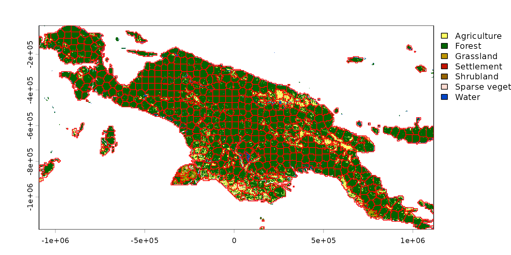

# Supercells of spatial categorical patterns

> **Version note:** This vignette documents the
> [`supercells()`](https://jakubnowosad.com/supercells/reference/supercells.md)
> interface as it existed in version 1.0 of the package. Some arguments,
> defaults, and behaviors may differ in newer releases. For up-to-date
> details, see
> [`?sc_slic`](https://jakubnowosad.com/supercells/reference/sc_slic.md)
> and the current reference docs.

Superpixels are a collection of segmentation concepts of grouping pixels
with similar characteristics. In this package, we refer to them as
supercells. It is often used in computer vision to delineate parts of
RGB images that are more meaningful and easier to analyze. When applied
to RGB images, each superpixel contains similar colors that also could
represent real-world objects. A large number of methods for creating
superpixels were developed in the last decades, with the SLIC algorithm
(Achanta et al. (2012), <doi:10.1109/TPAMI.2012.120>) being the most
prominent.

The **supercells** package aims to utilize the concept of supercells for
a variety of spatial data. This package works on spatial data with one
variable (e.g., continuous raster), many variables (e.g., RGB rasters),
and spatial patterns (e.g., areas in categorical rasters). Therefore, it
enables not only to find areas that look similar on an RGB (satellite)
image, but also to regionalize areas with comparable values of one or
more variables.

This vignette shows how to use the **supercells** package on a
categorical raster dataset. To reproduce the following results on your
own computer, install and attach the packages:

``` r
library(supercells)    # supercells for spatial data
library(terra)         # spatial raster data reading and handling
#> terra 1.8.93
library(sf)            # spatial vector data reading and handling
#> Linking to GEOS 3.12.1, GDAL 3.8.4, PROJ 9.4.0; sf_use_s2() is TRUE
library(motif)         # tools for working with categorical spatial patterns
```

The first step is to read the input data. This time our input data
`landcover2015.tif`, included in the **motif** package, that contains
land cover data for New Guinea.

``` r
landcover = rast(system.file("raster/landcover2015.tif", package = "motif"))
plot(landcover)
```


Next, we need to derive some key information about the categorical
spatial patterns of the New Guinea land cover. This can be done with
**motif** – below, we calculate compositions of land cover categories
(learn about it more in Nowosad (2021)) for non-overlapping windows of
20 by 20 cells, and then convert it back into a **terra** object.

``` r
comp_output = lsp_signature(landcover, type = "composition", window = 20,
                             normalization = "pdf", ordered = FALSE)
#comp_output = lsp_restructure(comp_output)
comp_output = lsp_add_terra(comp_output)
comp_output
#> class       : SpatRaster 
#> size        : 191, 368, 9  (nrow, ncol, nlyr)
#> resolution  : 6000, 6000  (x, y)
#> extent      : -1091676, 1116324, -1184556, -38556.49  (xmin, xmax, ymin, ymax)
#> coord. ref. : +proj=cea +lat_ts=5.5 +lon_0=140.8 +x_0=0 +y_0=0 +ellps=WGS84 +units=m +no_defs 
#> source(s)   : memory
#> names       :    id, na_prop, X1, X2, X3,        X4, ... 
#> min values  :     1,     0.0,  0,  0,  0, 0.0000000, ... 
#> max values  : 70288,     0.9,  1,  1,  1, 0.4690909, ...
```

The result, `comp_output`, contains two layers with metadata (`id` and
`na_prop`), and sever layers with a proportion of each land cover
category for each window. We can select only the latter layers as the
metadata is not needed for the following calculations.

``` r
comp_output2 = subset(comp_output, 3:9)
plot(comp_output2)
```



Finally, we are able to use the
[`supercells()`](https://jakubnowosad.com/supercells/reference/supercells.md)
function to delineate areas with similar proportions of different land
cover categories. I decided to derive about 2,000 supercells that will
be created based on the Jensen-Shannon distance (`dist_fun = "jsd"`).
This distance measure is more suitable for proportions (e.g., 0-1) than
the default Euclidean distance.

``` r
slic = supercells(comp_output2, k = 2000, compactness = 0.1, dist_fun = "jsd")
```

The result is an `sf` object containing derived supercells with
attributes storing the average proportions for each supercell:

``` r
plot(landcover, reset = FALSE)
plot(st_geometry(slic), add = TRUE, border = "red")
```



## References

Achanta, Radhakrishna, Appu Shaji, Kevin Smith, Aurelien Lucchi, Pascal
Fua, and Sabine Süsstrunk. 2012. “SLIC Superpixels Compared to
State-of-the-Art Superpixel Methods.” *IEEE Transactions on Pattern
Analysis and Machine Intelligence* 34 (11): 2274–82.

Dorst, HG. 2018. “Philentropy: Information Theory and Distance
Quantification with R.” *Journal of Open Source Software* 3 (26): 765.

Lin, Jianhua. 1991. “Divergence Measures Based on the Shannon Entropy.”
*IEEE Transactions on Information Theory* 37 (1): 145–51.
<https://doi.org/djxkkh>.

Nowosad, Jakub. 2021. “Motif: An Open-Source R Tool for Pattern-Based
Spatial Analysis.” *Landscape Ecology* 36 (1): 29–43.
<https://doi.org/ghfsnh>.

Nowosad, Jakub, and Tomasz F. Stepinski. 2022. “Extended SLIC
Superpixels Algorithm for Applications to Non-Imagery Geospatial
Rasters.” *International Journal of Applied Earth Observation and
Geoinformation* 112 (August): 102935.
<https://doi.org/10.1016/j.jag.2022.102935>.
