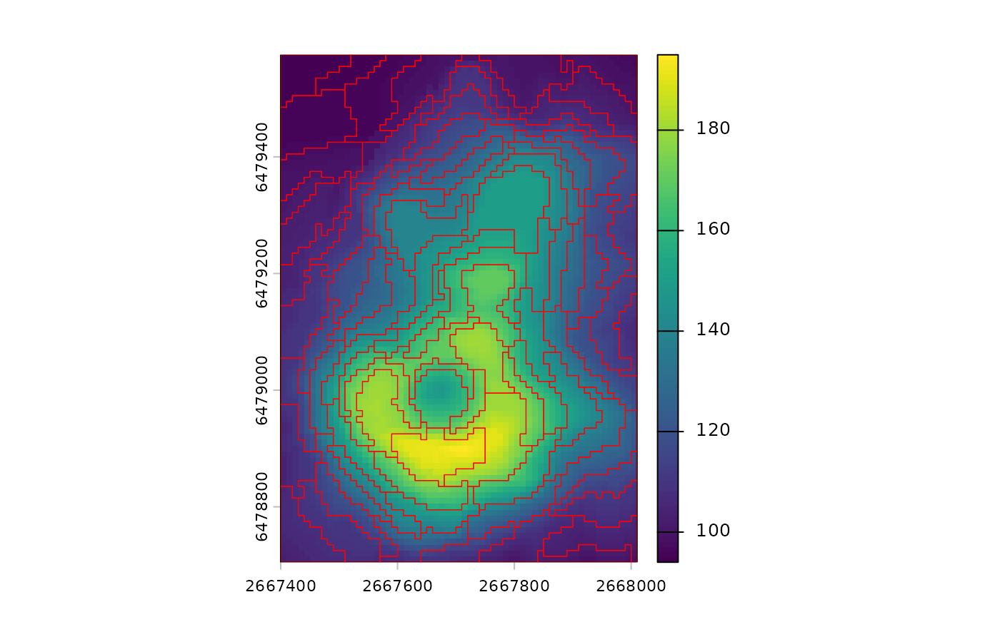

# Introduction to supercells

The **supercells** package creates compact, homogeneous regions from
raster data. It replaces thousands or millions of pixels with a smaller
number of meaningful spatial units. This helps with interpretation,
visualization, and downstream modeling. It also reduces noise while
preserving important spatial structure.

The package is designed to work with rasters that have many layers or
time steps. It supports multiple distance measures such as
Jensen–Shannon divergence or dynamic time warping, as well as
user-defined distance functions, so similarity can be adapted to the
data. It can therefore handle diverse data types and high-dimensional
inputs without changing the main workflow. The package core ideas are
described in Nowosad and Stepinski (2022).

## Core functions

The main function in the package is
[`sc_slic()`](https://jakubnowosad.com/supercells/reference/sc_slic.md).
It implements a SLIC-style algorithm that balances spatial compactness
with value similarity (Achanta et al. 2012) and extends it to work with
multi-layer rasters and custom distance functions. The output is a set
of polygon supercells stored as an `sf` object. This object can include
centers, average values, and IDs depending on the requested outcomes. In
practice,
[`sc_slic()`](https://jakubnowosad.com/supercells/reference/sc_slic.md)
is the entry point for most workflows.

The key tuning arguments in
[`sc_slic()`](https://jakubnowosad.com/supercells/reference/sc_slic.md)
are `step` and `compactness`. `step` sets the spacing of initial centers
and controls the expected number of supercells. It can be thought of as
the expected spatial scale of the output. `compactness` controls the
tradeoff between spatial regularity and value similarity. Lower values
prioritize value similarity and may lead to irregular shapes, while
higher values prioritize shape regularity – supercells may look more
like squares – but may be less homogeneous in terms of values.

For compactness selection, you may use
[`sc_tune_compactness()`](https://jakubnowosad.com/supercells/reference/sc_tune_compactness.md)
to estimate a good value from a short pilot run. Alternatively, the
`"auto"` option for `compactness` enables SLIC0-style adaptive
compactness when you want the algorithm to adjust locally – this does
not require setting a specific value, but also takes away direct
control.

To assess quality of the resulting supercells, use
[`sc_metrics_pixels()`](https://jakubnowosad.com/supercells/reference/sc_metrics_pixels.md)
for pixel-level distances,
[`sc_metrics_supercells()`](https://jakubnowosad.com/supercells/reference/sc_metrics_supercells.md)
for per-supercell summaries, and
[`sc_metrics_global()`](https://jakubnowosad.com/supercells/reference/sc_metrics_global.md)
for a general overview. These metrics help compare different parameter
settings or input preprocessing choices.

## Workflow summary

Basic workflows follow the same pattern: choose scale (`step` or `k`),
tune or set `compactness`, create supercells, and evaluate.

``` r
# read data
vol <- terra::rast(system.file("raster/volcano.tif", package = "supercells"))

# choose scale and tune compactness
tune <- supercells::sc_tune_compactness(vol, step = 8, metrics = "local")

# create supercells
vol_sc <- supercells::sc_slic(vol, step = 8, compactness = tune$compactness)

# evaluate
metrics_global <- supercells::sc_metrics_global(vol, vol_sc)
```

## Minimal example

The goal of this example is to derive supercells from a raster and
visualize them. For that purpose, we will use the built-in `volcano`
dataset, which is a small raster of elevation values.

``` r
library(supercells)
library(terra)

vol <- terra::rast(system.file("raster/volcano.tif", package = "supercells"))
```

This raster has 5307 cells – a small number for demonstration, but the
same workflow applies to much larger rasters as well. Moreover, it has
only one layer – but the same functions can handle multi-layer rasters
with any number of layers.

Below, we create supercells in three different formats: polygons,
points, and raster IDs. The polygon supercells are the most common
output. Here, we specified `step = 8` which would result in supercells
of approximately 8x8 cells in size if they were perfectly regular, but
the actual shapes and sizes will depend on the data and the
`compactness` setting. The compactness is set to `1` – the behavior of
this parameter depends on many factors, including the range of values in
the raster, their properties, and the selected distance measure.

``` r
# Polygon supercells (sf)
vol_sc <- sc_slic(
  vol,
  step = 8,
  compactness = 1
)

terra::plot(vol)
plot(sf::st_geometry(vol_sc), add = TRUE, lwd = 0.6, border = "red")
```



The resulting `sf` object contains one row per supercell. Each row
stores summary values of each layer in the original raster, as well as
the geometry of the supercell. By default only summary values are
returned, so use `outcomes = c("supercells", "coordinates", "values")`
when you also want IDs and center coordinates.

Two related functions provide alternative output formats. Use
[`sc_slic_points()`](https://jakubnowosad.com/supercells/reference/sc_slic_points.md)
to return only supercell centers as points. Use
[`sc_slic_raster()`](https://jakubnowosad.com/supercells/reference/sc_slic_raster.md)
to return a raster of supercell IDs for large datasets or raster-based
pipelines. These functions share the same core arguments and can be
swapped with minimal changes.

Now, let’s try to tune the `compactness` parameter using a pilot run.

``` r
tune <- sc_tune_compactness(
  vol,
  step = 8,
  metrics = "local"
)
tune
#>   step metric compactness
#> 1    8  local    9.084872
```

Next, we may try to create supercells with the suggested `compactness`
value.

``` r
vol_sc_tuned <- sc_slic(
  vol,
  step = 8,
  compactness = tune$compactness
)

terra::plot(vol)
plot(sf::st_geometry(vol_sc_tuned), add = TRUE, lwd = 0.6, border = "red")
```


Such a derived compactness value may serve as a good starting point for
further experimentation.

Afterwards, we can evaluate the quality of the resulting supercells
using metrics on different levels.

``` r
pixel_metrics <- sc_metrics_pixels(vol, vol_sc_tuned)
supercell_metrics <- sc_metrics_supercells(vol, vol_sc_tuned)
global_metrics <- sc_metrics_global(vol, vol_sc_tuned)
```

The pixel-level metrics show how well the supercells represent the
original raster values at the pixel level. By default they include
`spatial`, `value`, `combined`, and `balance`. When `scale = TRUE` (the
default), the spatial and value layers are returned as `spatial_scaled`
and `value_scaled`.

``` r
plot(pixel_metrics, nr = 1)
```


These maps help diagnose where spatial or value coherence is weak. For
example, large patches of high values can indicate areas where the
chosen parameters may be too coarse for local variation.

The supercell-level metrics summarize each polygon as a single value.
These are helpful when you want to compare supercells or join metrics to
attributes.

``` r
plot(supercell_metrics)
```


The global metrics provide a single-row summary of overall quality. They
are useful for comparing parameter settings across multiple runs, such
as a small grid of `step` and `compactness` values.

``` r
global_metrics
#>   step compactness n_supercells mean_spatial_dist_scaled mean_value_dist_scaled
#> 1    8    9.084872           88                0.4546412              0.3061439
#>   mean_combined_dist    balance
#> 1          0.5915118 -0.4939904
```

## Where to go next

To learn more about the package and its capabilities, check out the
following articles:

- [**Choosing parameters**: a practical guide to `step`, `k`, and
  `compactness`.](https://jakubnowosad.com/supercells/articles/v2-parameters.html)
- [**Evaluation and diagnostics**: how to read and compare pixel,
  supercell, and global
  metrics.](https://jakubnowosad.com/supercells/articles/v2-evaluation.html)
- [**Benchmarks**: performance
  notes.](https://jakubnowosad.com/supercells/articles/v2-benchmarks.html)
- [**Changes since v1**: a concise summary of what’s new in
  v2.](https://jakubnowosad.com/supercells/articles/v2-changes-since-v1.html)

## References

Achanta, Radhakrishna, Appu Shaji, Kevin Smith, Aurelien Lucchi, Pascal
Fua, and Sabine Süsstrunk. 2012. “SLIC Superpixels Compared to
State-of-the-Art Superpixel Methods.” *IEEE Transactions on Pattern
Analysis and Machine Intelligence* 34 (11): 2274–82.

Nowosad, Jakub, and Tomasz F. Stepinski. 2022. “Extended SLIC
Superpixels Algorithm for Applications to Non-Imagery Geospatial
Rasters.” *International Journal of Applied Earth Observation and
Geoinformation* 112 (August): 102935.
<https://doi.org/10.1016/j.jag.2022.102935>.
